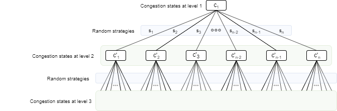

## Idea

Create a random traffic generator - a model based on a virtual city where vehicles are being instantiated in the city and choose random routes -. In this model, vehicles circulate following a policy imposed by traffic lights that can have varying and strategies
(different frequencies, different sequences to distribute traffic, etc). See animation below.

Visualization of the traffic flow of a virtual city. Red bars represent traffic congestion, while green lines are the active connections between roads that the traffic lights dictate.

Then idea is to build vanilla Neural Network that gets as inputs the congestion levels at a given time of all roads in the city and the strategy being followed by the traffic lights.
The outputs of the NN are the congestion levels of all the roads in the city after X timeframes (obtained by running a simulation
of the vehicles moving throughout the city following the policies imposed by the traffic lights). By doing so, the NN 
can predict in a very computationally inexpensive way what is going to be the congestion level of all roads in the city after
X timestamps without the need of actually carrying the simulation (see Figure below).

  

Figure: Topology of Predictor Neural Network

The idea is then to perform an exhaustive tree search to 
allocate the best possible strategy to all traffic lights to minimize congestion. This is done by, starting with the given
level of congestion of all roads, creating multiple children, each one having a randomly allocated strategy for each traffic light.
Therefore, each children contains the congestion levels of the road after X seconds, and recursively generates more children.
All nodes encountered in the same level of the tree therefore represent a set of possible road congestion levels at one time (see Figure below). The MCST therefore aims to search for a node in a given level for which the added sum of the roads congestion levels is minimum.

  

Figure: Stucture of the MCST
